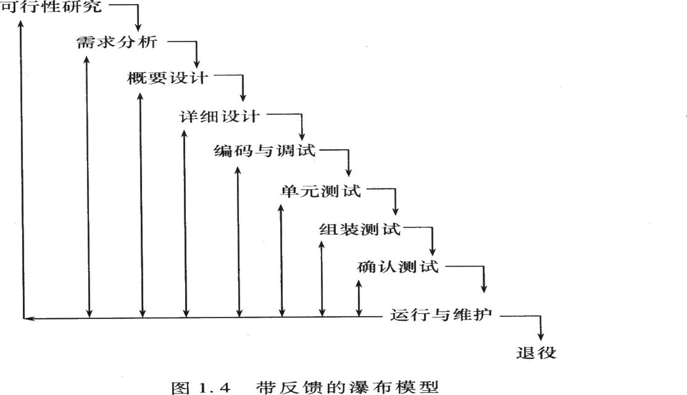
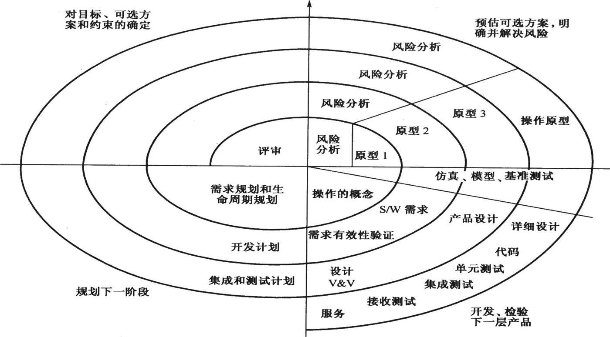
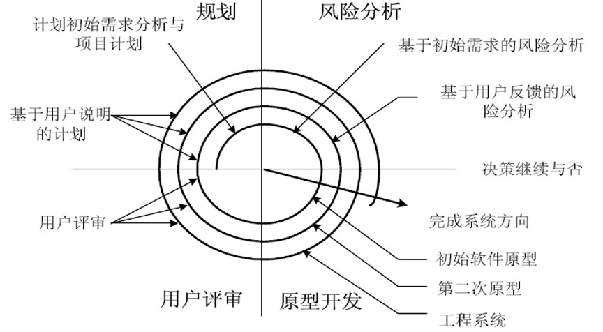
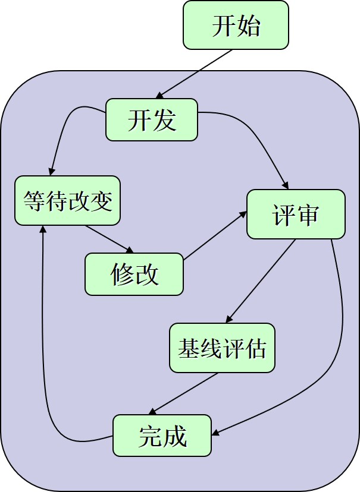

# 传统软件工程学科中的概念、相关知识点总结

## 软件与软件工程

### 软件的概念、软件的特点、软件发展的四个阶段

#### 软件的概念
- 软件是计算机系统的重要组成部分；
- 软件是逻辑产品，需要计算机硬件和系统软件的支撑；
- 软件是计算机控制系统的指挥中枢；
- 软件是信息转换器，它能对信息进行加工、处理或变换；
- 软件是工具，在人们的生活、工作、休闲，在社会的经济、军事、政治、文化、科学技术、教育中发挥具大作用

> 软件是能够完成预定功能和性能，并对相应数据进行加工的程序和描述程序及其操作的文档。  
> 软件 = 程序+数据+文档  
> 程序 = 算法+数据结构

#### 软件的特点

- 软件是被开发或设计的,而不是传统意义上被制造的
- 软件不会”磨损”
- 软件产业逐步走向基于构件的组装,但还是定制的

#### 软件发展的四个阶段
- 1950---1965,没有系统的软件开发方法和管理机制、自定义软件、批处理、有限分布。
- 1965---1975,产生人机交互的新概念、新技术软件产品、多用户、实时、数据库。
- 1973---1988,微处理器的出现并广泛应用,分布式系统、嵌入智能、低成本硬件、消费者的影响。
- 1986---2000,广域和局域网络迅速普及,强大的桌面系统、面向对象技术、专家系统、人工智能、神经网络、并行计算、网络计算机。

### 软件危机产生的原因，解决软件危机的方法

#### 软件危机产生的原因

- 软件的规模加大、复杂性提高、性能增强
- 软件是逻辑产品, 尚未完全认识其本质和特点
- 缺乏有效的、系统的开发、维护大型软件项目的技术手段和管理方法
- 用户对软件需求的描述和软件开发人员对需求的理解往往存在差异，用户经常要求修改需求，开发人员很难适应
- 软件开发的技术人员和管理人员缺乏软件工程化的素质和要求，对工程化的开销认识不足

#### 解决软件危机的办法

- 

### 软件工程的概念，软件工程的三要素

#### 软件工程的概念

- 软件工程 Fritz Bauer[nau69]：为了经济的获得可靠的，在实际机器上高效运行的软件，而建立和使用的好的工程原则。
- 软件工程 [ 教材]：软件工程是运用工程、科学和数学的原则与方法研制、维护计算机软件的有关技术和管理的方法。
- 软件工程[IEEE93]：将系统的、规范的、可度量的方法应用于软件的开发、运行和维护的过程。

#### 软件工程的三要素

过程、工具、方法

### 软件生命周期个阶段及其基本任务

- 软件定义  
    - 问题定义：确定系统的总体目标
    - 可行性分析：研究经济、技术、操作等的可信性
    - 需求分析：收集需求，需求建模
- 软件开发  
    - 系统设计：软件结构设计、数据设计、接口设计和过程设计
    - 编码：产生源程序清单
    - 测试： 产生软件测试计划和软件测试报告  
- 软件运行  
    - 维护：修改、完善、扩展软件

### 软件开发过程模型：瀑布模型、原型模型、螺旋模型等几种模型的形式与特点及使用范围

#### 瀑布模型

- 主要思想：  

软件开发过程与软件生命周期是一致的  
相邻二阶段之间存在因果关系  
需对阶段性产品进行评审  

- 示意图：


- 瀑布模型的优点：  
软件生命周期模型，使软件开发过程可以再分心、设计、编码、测试和维护的框架下进行  
软件开发过程具有系统性、可控性，客服了软件开发的随意性  

- 瀑布模型的缺点：  
项目开始阶段很难精确提出产品需求，由于技术进步，用户对系统深入的理解，修改需求十分普遍  
项目开发晚期才能的带程序的运行版本，这是修稿软件需求和开发中的错误代价很大  
采用线性模型组织项目开发经常发生开发小组人员“堵塞状态”，特别是项目的开始和结束  

#### 原型模型

- 原型模型示意图
 

- 优点：  
原型模型支持软件需求开发，帮助用户和开发人员理解需求，使软件需求工程的关键  
它产生的正式需求文档，是软件开发的基础  
如果开发的原型是可运行的，它的若干高质量的程序片段和开发工具可用于工作程序的开发  
原型的开发和评审时系统分析员和用户/客户共同参与的迭代过程，每个迭代循环都是线性过程  

- 缺点：  
对于大型软件项目，RAD模型需要足够的人力资源已建立足够的原型组  
RAD模型要求开发者和客户再一段时间内共同完成原型系统的开发，如果任何一方没有实现承诺，会导致原型开发的失败  
如果系统难以模块化，建造RAD模型所需构建就有问题，如果高性能是一个指标，RAD模型也可能不奏效  
RAD模型不适合采用很多新技术的项目  

- RAD模型的开发过程：  
业务建模-> 数据建模->过程建模->应用生成->测试修正

#### 螺旋模型

- 螺旋模型=线性模型+迭代，原型+系统化  
螺旋模型适用于计算机软件整个生命周期  

- 示意图 

- 示意图   

- 优点：   
符合人们认识现实世界和软件开发的客覌规律；  
支持软件整个生命周期；  
保持瀑布模型的系统性、阶段性；  
利用原型评估降低开发风险；  
开发者和用户共同参与软件开发，尽早发现软件中的错误；  
不断推出和完善软件版本，有助于需求变化，获取用户需求，加强对需求的理解。  

#### 增量模型

- 小而可用的软件  

- 特点：  
在前面增量的基础上开发后面的增量  
每个增量的开发可用瀑布或快速原型模型  
迭代的思路  

#### 并发开发模型

- 示意图：  

#### 形式化开发方法

- 用严格的、数学的符号体系来规约、开发和验证基于计算机的系统。
解决软件开发过程使用其它范型难以克服的二义性、不完整性和不一致性。
可以产生无缺陷软件的承诺。
费时、昂贵、难沟通，需要培训
是建造重要的、安全的软件的开发者可以考虑开发范型。比如：航空电子、医疗设备软件的开发。

## 软件项目管理

### 软件项目管理的基本概念

软件项目管理 
- 人员管理  
    - 项目参与者
    - 项目负责人呢
    - 软件项目组
    - 协调通信问题
- 产品管理  
    - 软件范围
    - 问题分解
- 过程管理  
    - 确定软件过程模型
    - 过程分解
- 项目管理  
    - 确定危险信息
    - 确定解决方案

### 软件项目估算（代码行、功能点估算）

### McCabe度量法，能完成环路复杂度的度量

### 成本估算方法及其特点

估算可以采用经验公式、或参考历史资料  
估算用于事前签订合同、立项、制定工作计划等

### 关键路径法

### CMM与CMMI的基本概念

## 需求分析基础

### 软件需求内同

### 需求分析常用技术

### 结构化分析方法

### 数据流图（DFD）的作用，能用数据流图完成需求分析，能废除精化数据流图，数据字典

## 软件设计基础

### 设计阶段主要任务

### 软件设计准则（抽象、信息隐蔽、模块化、自顶向下逐步求精等）

### 高内聚低耦合度的含义

### 熟悉中变换分析和事务分析，能用两种方法分析和构建软件乘此结构图

### 详细设计工具（程序流程图、盒图（N-S图）与PAD图之间的转化，能将伪码或程序转换成程序流程图、盒图（N-S图）与PAD图

## 软件测试

### 软件测试的目的和原则，软件测试流程

### 软件测试计划

### 软件测试技术（白盒测试、黑盒测试、利用软件测试技术进行软件测试、设计测试用例）

### 软件测试策略（单元测试、集成测试、确认测试、验收测试、系统测试）的基本概念


```
考试常见题型（天大）
一、名词解释（4分*5）
二、简答 （6分*5）
三、设计题（15分*2）
四、建模（10分*2）

```


